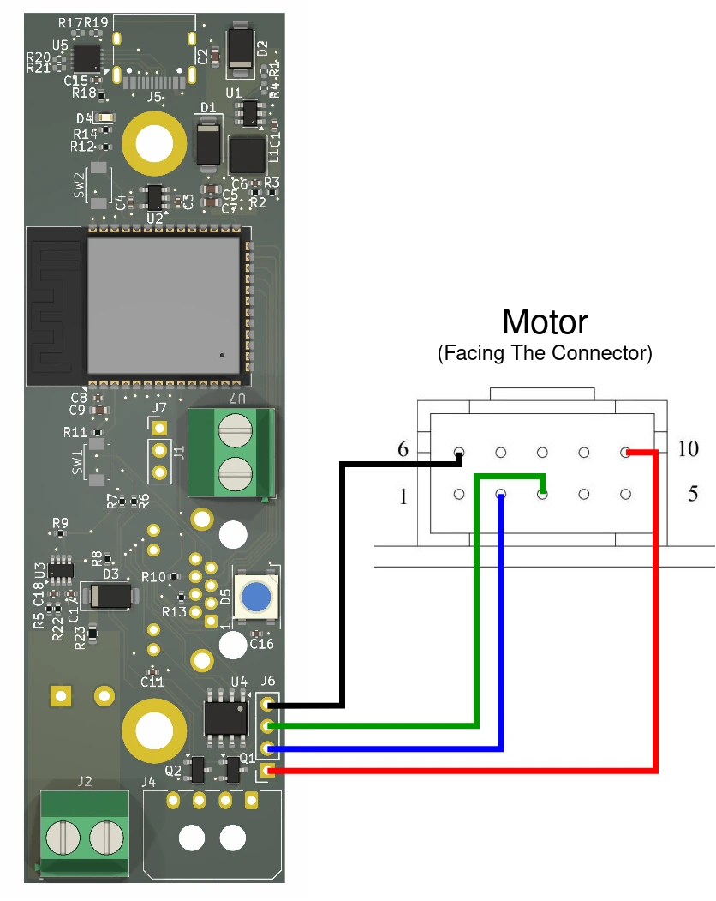

# OSSM-RS

An alternative firmware for OSSM written in Rust

You can find the original hardware and software [here](https://github.com/KinkyMakers/OSSM-hardware/tree/master)

## Features

- Full RS485 based motor control
- Motor settings set automatically
- S-curve motion planning
- Strict mechanical bounds checks
- Adjusting depth, velocity, and stroke start on the fly
- Off-the-shelf control board support
- Patterns

## Trying It Out

### Getting Ready

1. Install Rust using the instructions [here](https://rustup.rs)
  - Windows
    - Download and run [rustup-init](https://win.rustup.rs/x86_64)
    - Select "Quick install via the Visual Studio Community installer"
    - Select "Proceed with standard installation (default - just press enter)"
  - Linux or MacOS
    ```bash
    curl --proto '=https' --tlsv1.2 -sSf https://sh.rustup.rs | sh
    ```

2. Open a terminal

3. Install the ESP Rust toolchain for Xtensa devices as well as the `espflash` tool for flashing devices by running the following commands:
```bash
cargo install espup --locked
espup install
cargo install espflash --locked
```

More information can be found [here](https://docs.espressif.com/projects/rust/book/getting-started/toolchain.html#xtensa-devices)

### Compiling And Uploading

1. See the [board support](#board-support) section to see if your board is supported and use the feature flag in the next step

2. If on Linux or MacOS set the environment variables with:
```bash
. $HOME/export-esp.sh
```

3. Compile with and upload with:
```bash
cargo run --release --features board_<name>
```

## Remote Support

- [M5 remote](https://github.com/ortlof/OSSM-M5-Remote)
- [OSSM BLE Protocol](https://github.com/KinkyMakers/OSSM-hardware/blob/master/Software/src/services/communication/BLE_Protocol.md)

## Motor Support

### 57AIMxx RS485

Power pinout (motor shaft facing up):


Data pinout used for the diagrams (motor shaft facing down):


| Pin # | Function    | Description                                           |
|-------|-------------|-------------------------------------------------------|
| 1     | NC          |                                                       |
| 2     | RS485_A     | RS485 +                                               |
| 3     | RS485_B     | RS485 -                                               |
| 4     | NC          |                                                       |
| 5     | NC          |                                                       |
| 6     | COM         | Ground for RS485 and outputs                          |
| 7     | WR          | Alarm output (active low)                             |
| 8     | RDY/PF      | Encoder pulses                                        |
| 9     | ZO          | Encoder zero                                          |
| 10    | RS485_Power | 5V in the datasheet, but seems to take 3.3V just fine |

## Board Support

### WaveShare ESP32-S3-RS485-CAN (default)

Feature flag: `board_waveshare`


### OSSM Reference PCB v3

Feature flag: `board_ossm_v3`

The not yet released board from [here](https://github.com/KinkyMakers/OSSM-hardware/tree/xpi/PCB-v3/Hardware/PCB%20Files/OSSM%20Reference%20PCB%20V3)



### Custom Board

Feature flag: `board_custom`

Set pins in `main.rs` manually

## Patterns

### Default Patterns

The following patterns are supported:

- Simple
- TeasingPounding
- HalfHalf
- Deeper
- StopNGo

They are designed to closely mimic the patterns provided by the stock OSSM firmware.

### Making Custom Patterns

The list of patterns is stored under `pattern/mod.rs`

The easiest way to create your own is to copy, rename and modify one of the existing patterns in the `pattern` directory.
Don't forget to add it to `pattern/mod.rs` as well.

For details see the documentation of the `Pattern` trait and the related structs (`PatternInput` and `PatternMove`)

## Roadmap

Open an issue if you want to see something added

- [x] Off-the-shelf control board support
- [x] Patterns
- [x] R&D wireless remote support
