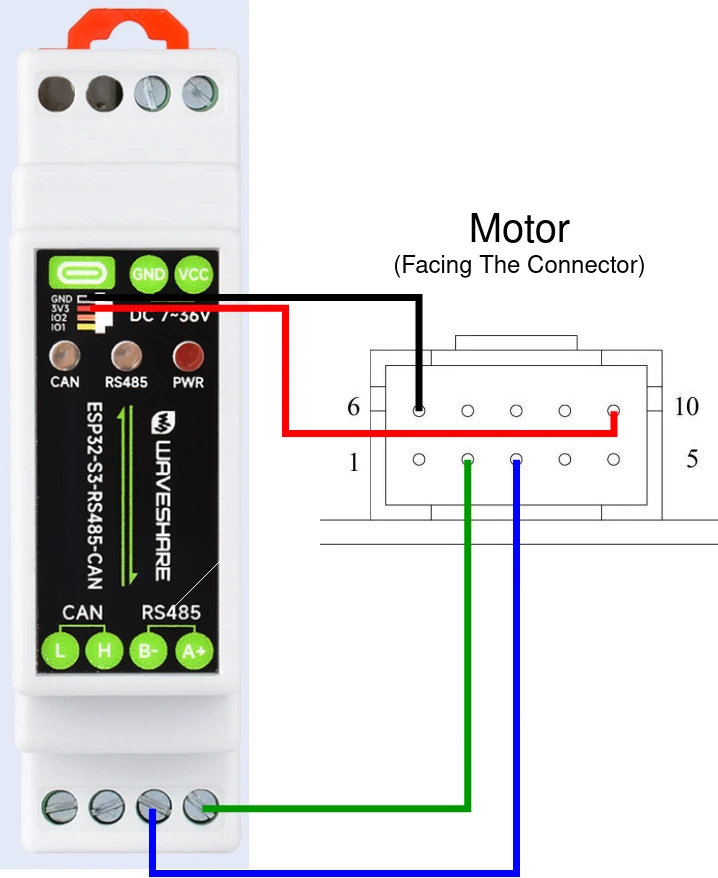

# OSSM-RS

And alternative firmware for OSSM written in rust.

You can find the original hardware and software [here](https://github.com/KinkyMakers/OSSM-hardware/tree/master)

## Features

- Full RS485 based motor control
- Motor settings set automatically
- S-curve motion planning
- Strict mechanical bounds checks
- Adjusting depth, velocity, and stroke start on the fly

## Trying it out

1. Install the toolchain for xtensa devices using the instructions from [here](https://docs.espressif.com/projects/rust/book/getting-started/toolchain.html#xtensa-devices)

2. See the [board support](#board-support) section to see if your board is supported and use the feature flag in the next step

3. Compile with and upload with:
```
cargo run --release --features board_<name>
```

## Remote Support

- [M5 remote](https://github.com/ortlof/OSSM-M5-Remote)

## Motor Support

### 57AIMxx RS485

Power pinout (motor shaft facing up):


Data pinout used for the diagrams (motor shaft facing down):


| Pin # | Function    | Description                                           |
|-------|-------------|-------------------------------------------------------|
| 1     | NC          |                                                       |
| 2     | RS485_A     | RS485 +                                               |
| 3     | RS485_B     | RS485 -                                               |
| 4     | NC          |                                                       |
| 5     | NC          |                                                       |
| 6     | COM         | Ground for RS485 and outputs                          |
| 7     | WR          | Alarm output (active low)                             |
| 8     | RDY/PF      | Encoder pulses                                        |
| 9     | ZO          | Encoder zero                                          |
| 10    | RS485_Power | 5V in the datasheet, but seems to take 3.3V just fine |

## Board Support

### WaveShare ESP32-S3-RS485-CAN (default)

Feature flag: `board_waveshare`



### Custom Board

Feature flag: `board_custom`

Set pins in `main.rs` manually


## Roadmap

- [x] Off-the-shelf control board support
- [ ] Patterns
- [ ] R&D wireless remote support
