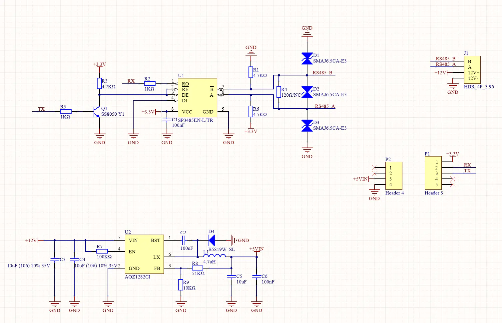
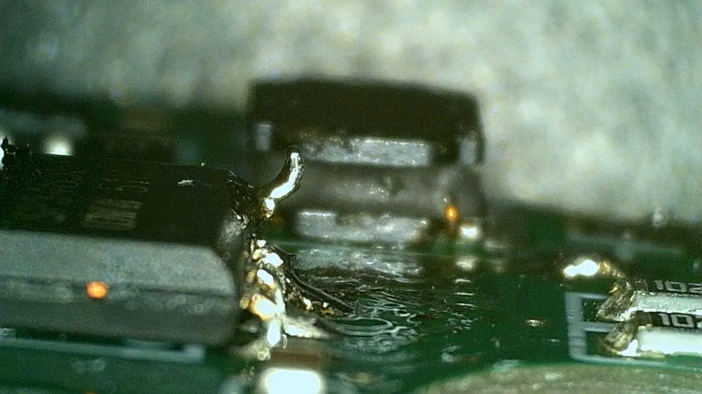
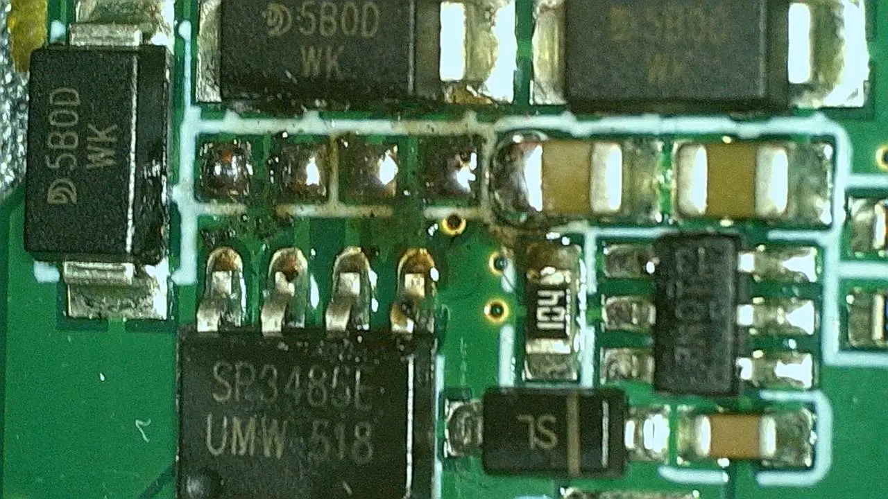
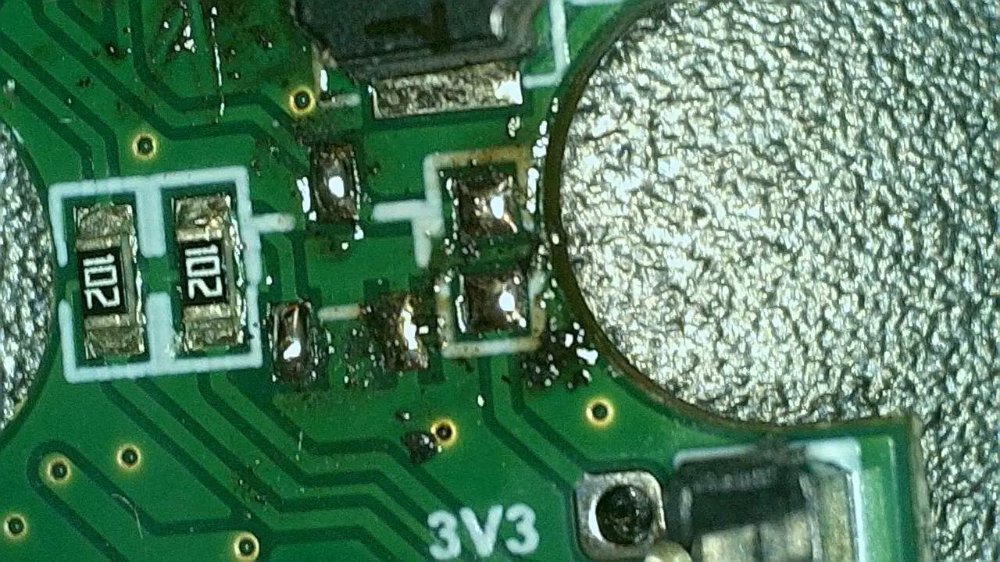
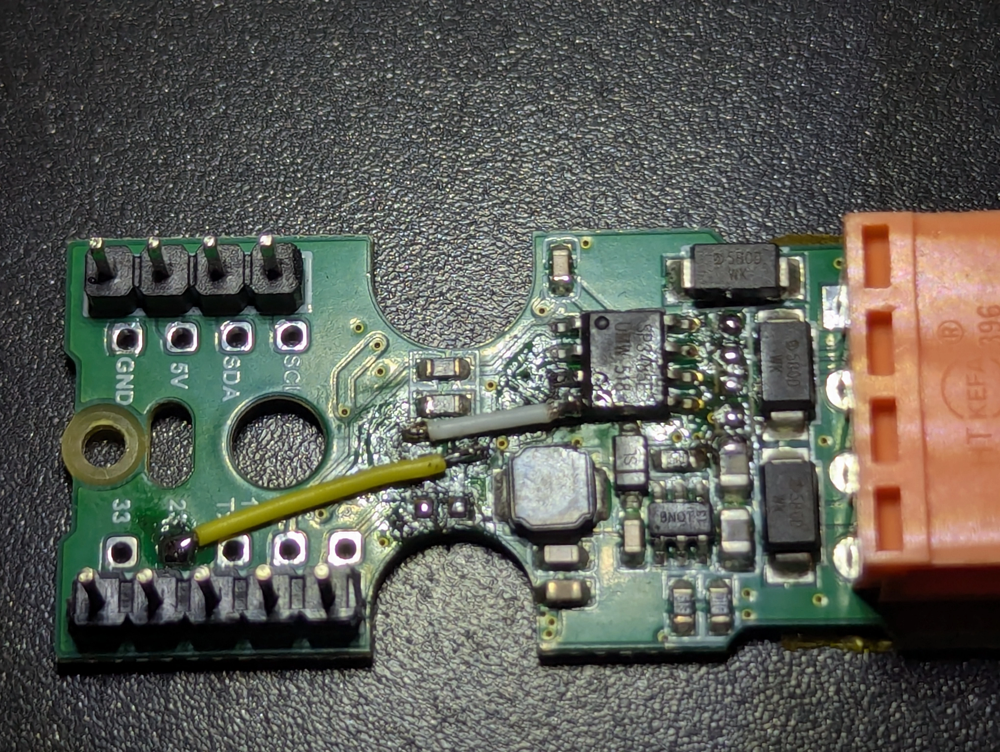
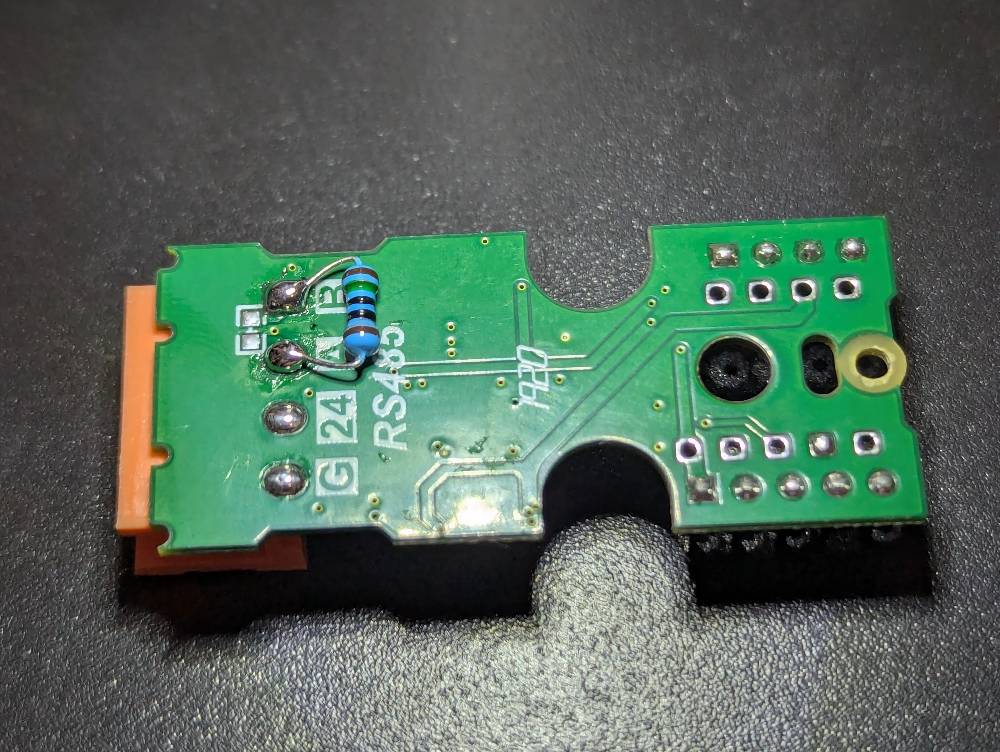

# Atomic RS485 Base Rework

## Why Is This Necessary

This board has a hack to save an extra pin for enabling the RS485 driver output.

The driver is enabled only on 1 on the TX pin.
On 0 the transceiver outputs are in high impedance mode and the pull up/down resistors are used on A/B to drive the bus.

This makes the signal completely unusable at 115200 bps
and almost completely unusable at 19200 bps (motor responds, but too glitchy to work).

## Schematic

## Rework

### 1. Bend the DI pin to disconnect it from ground

### 2. Remove the pull up/down 4.7 kΩ resistors

### 3. Remove the transistor and the 4.7 kΩ resistor

### 4. Solder 2 wires

- From DI to where the base of the transistor was connected (right after the 1K resistor going to TX)
- From DE and _RE to pin labeled 23 on the board

### 5 Add a 100-150Ω termination resistor between A and B

