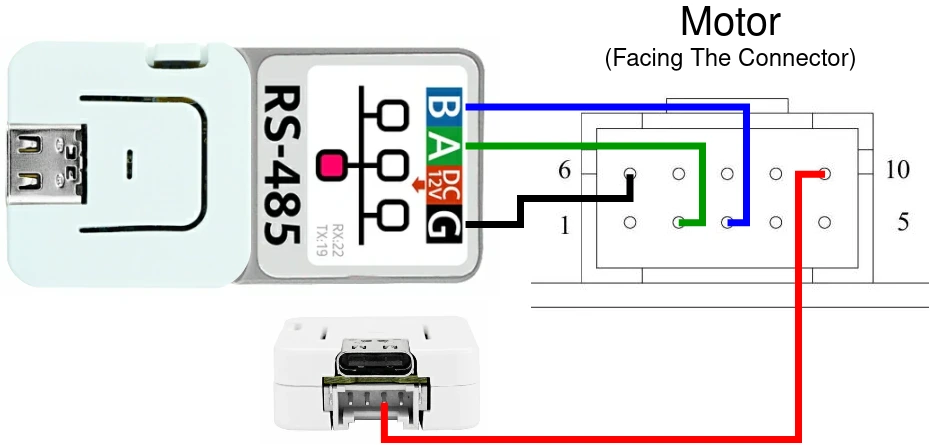
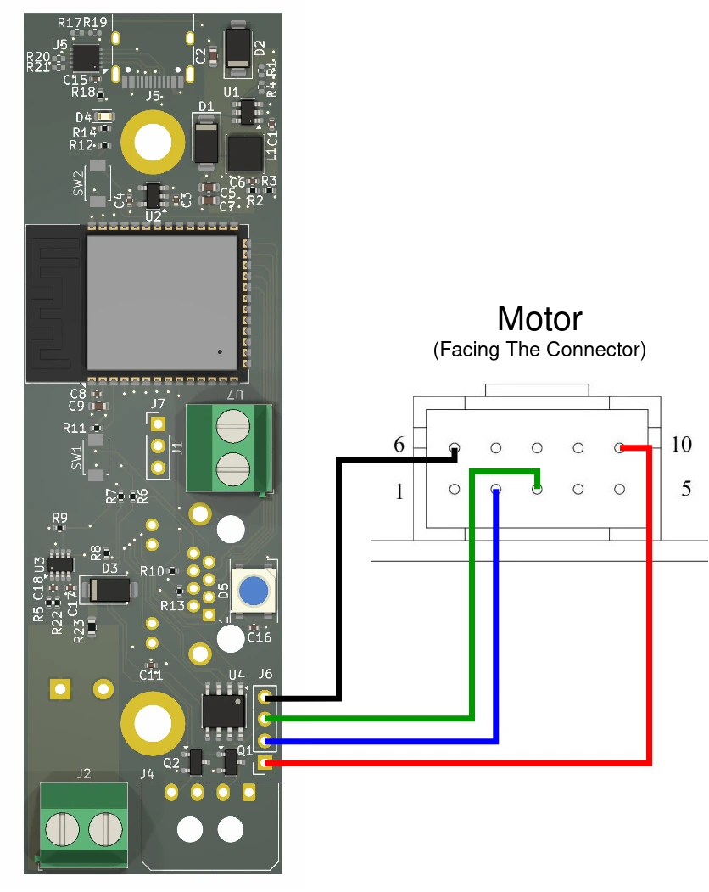

# Supported Boards

### WaveShare ESP32-S3-RS485-CAN (recommended)

Feature flag: `board_waveshare`

### Seeed Studio XIAO ESP32-S3

Feature flag: `board_seeed_xiao_s3`

You will need:
- Seeed Studio XIAO ESP32-S3
- RS485 Breakout Board for Seeed Studio XIAO

Notice how the 5V switch is in the OUT position and the 120R switch is in the ON position

### M5 Atom S3

Feature flag: `board_atom_s3`

#### ⚠️ This board does not work out of the box and requires soldering to make it work!

Instructions [here](docs/Atomic_RS485_Base/Atomic_RS485_Base_Rework.md)

⚠️ This board cannot be powered directly from the motor power supply if you use above 24V!

This "board" consists of a few components from the M5Stack ecosystem:
- AtomS3-Lite
- Atomic RS485 Base
- Grove Cable 10 cm

### OSSM Reference PCB v3

Feature flag: `board_ossm_v3`

The not yet released board from [here](https://github.com/KinkyMakers/OSSM-hardware/tree/xpi/PCB-v3/Hardware/PCB%20Files/OSSM%20Reference%20PCB%20V3)

### Custom Board

Feature flag: `board_custom`

Set pins in `main.rs` manually
